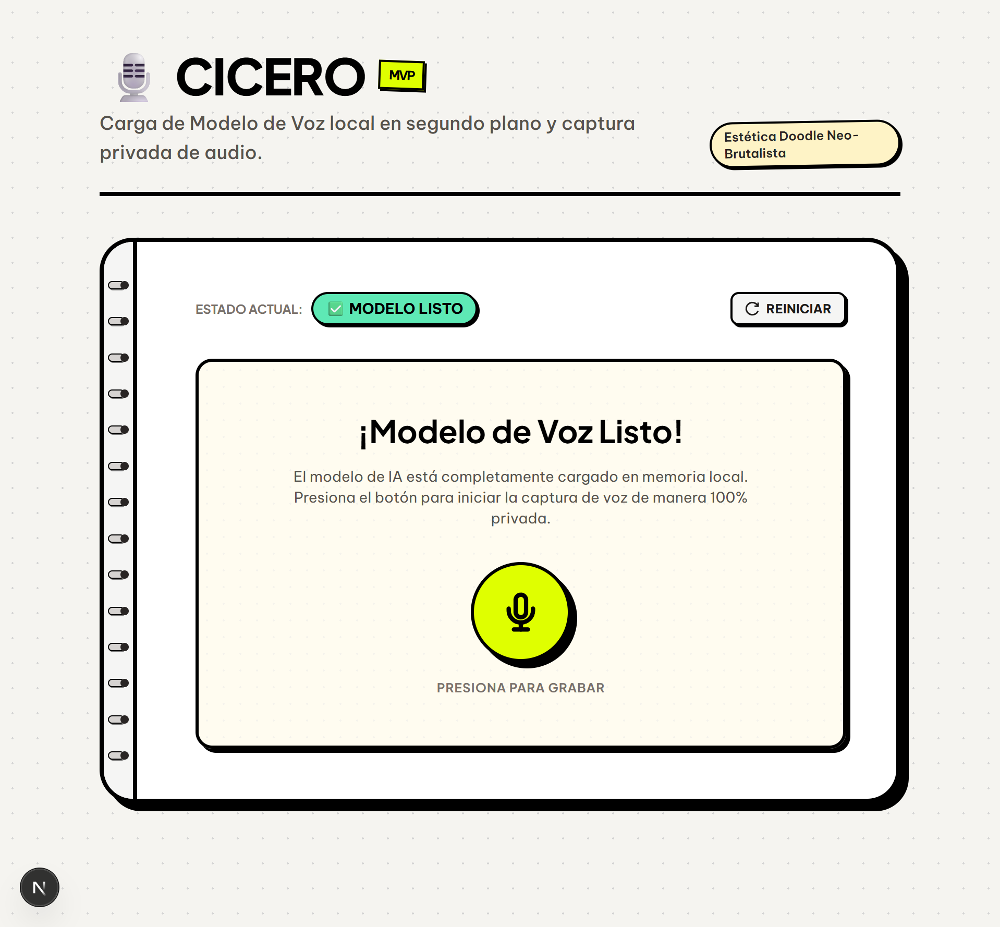
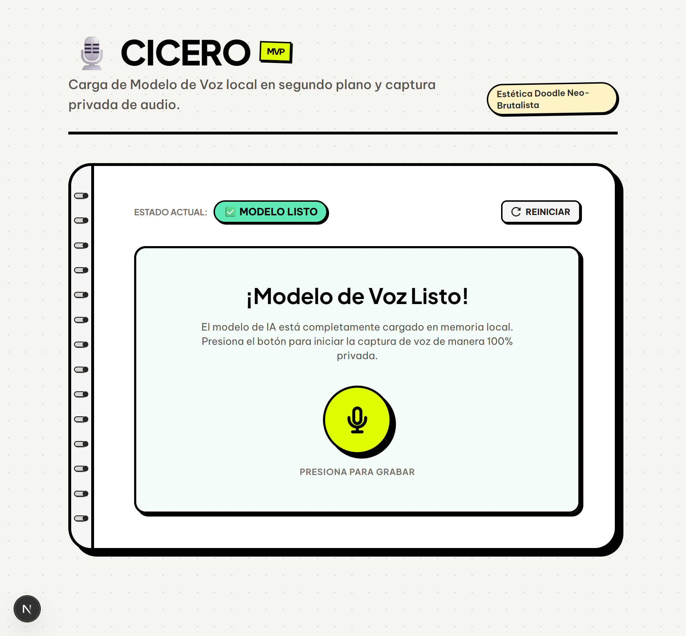
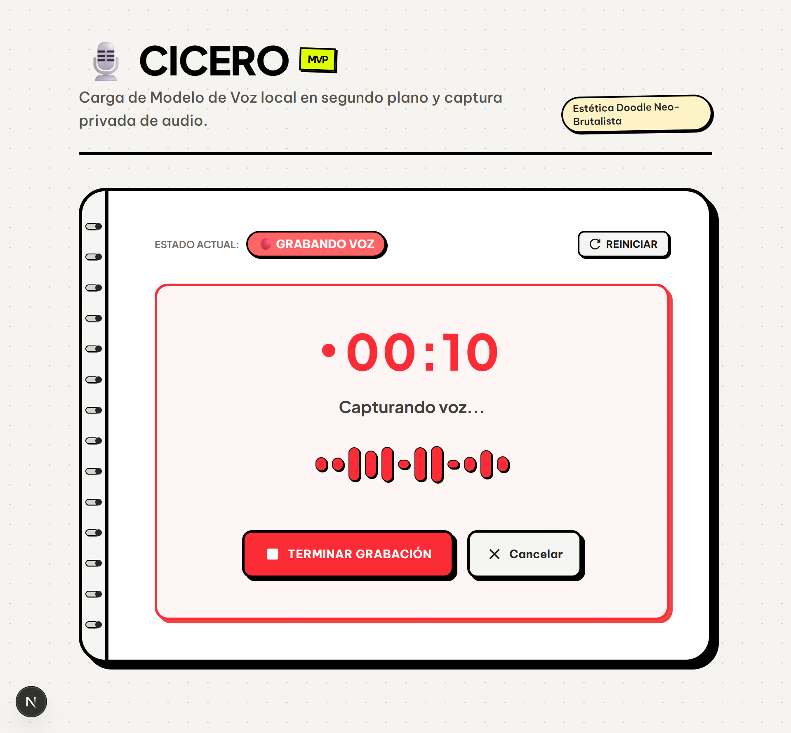
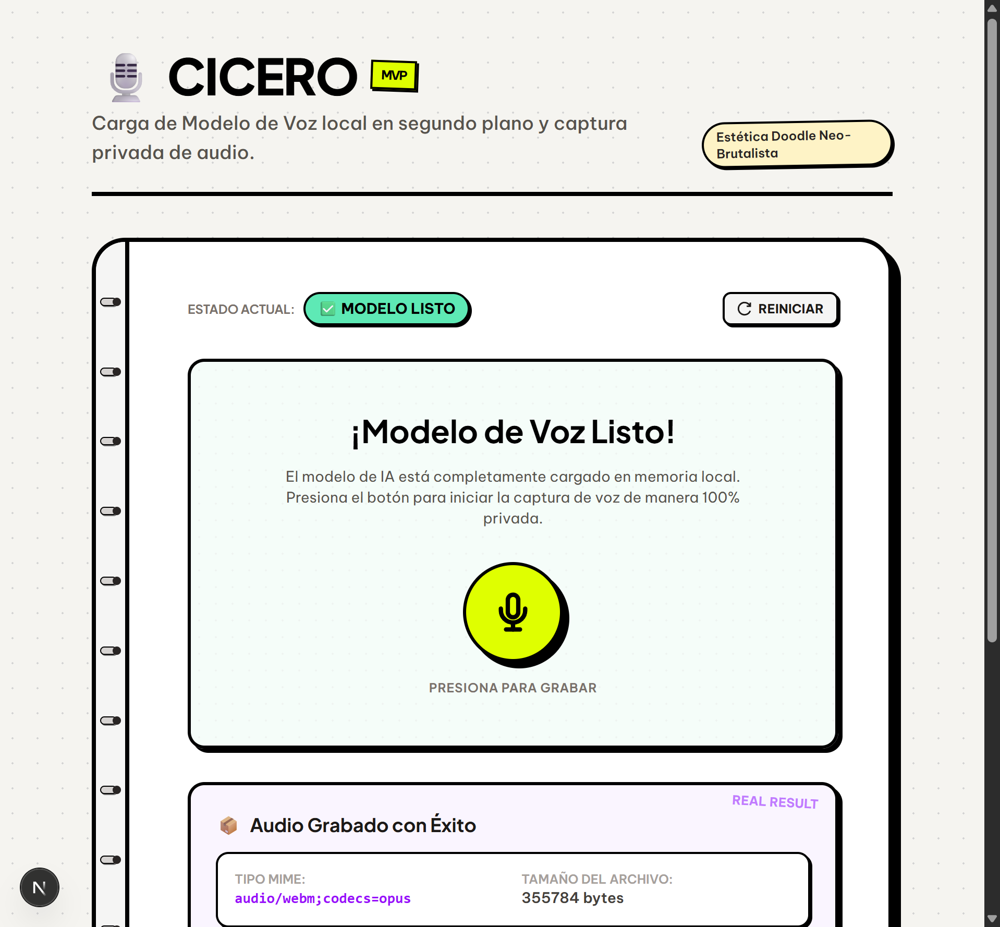

**Contexto:** Con los contratos definidos y la UI validada mediante mocks, el siguiente paso crítico del Hito 1 fue implementar la infraestructura real de grabación de audio y la inferencia cliente-side utilizando Transformers.js (ONNX Runtime Web).

**Decisión:** Desarrollar adaptadores de producción que encapsulen el acceso a las APIs nativas del navegador y delegar la ejecución del modelo de IA en un hilo secundario (Web Worker) con aceleración por WebGPU y fallback automático transparente a CPU (WebAssembly) para optimizar la CPU principal y maximizar la compatibilidad de hardware.

{/* truncate */}

### 💡 Detalles Técnicos Implementados

#### 1. Captura Real con `BrowserMediaRecorder`
*   **Códecs Dinámicos**: Implementa una búsqueda ordenada de tipos MIME soportados por el navegador (`audio/webm;codecs=opus` -> `audio/webm` -> `audio/ogg;codecs=opus` -> `audio/wav`), asegurando la máxima fidelidad y compresión posible en cada dispositivo.
*   **Permisos Silenciosos**: Durante la verificación inicial, el stream de audio se solicita y se apaga de inmediato. Esto evita dejar encendido el indicador de micrófono del navegador en la barra de tareas mientras el usuario no esté grabando activamente.

#### 2. Inferencia Multihilo en el Web Worker
*   **audio.worker.ts**: Se encarga del ciclo de vida del modelo de IA. Utiliza la librería `@huggingface/transformers` con la directiva `env.allowLocalModels = false` para forzar descargas en el cliente.
*   **Singleton de Inferencia**: Almacena las instancias del modelo a nivel global en el hilo secundario para evitar fugas de memoria y recargas redundantes entre renderizados de React.
*   **Verificación de Cuota**: Valida preventivamente con `navigator.storage.estimate()` que queden al menos 150 MB de almacenamiento persistente disponibles antes de iniciar descargas para el modelo `CrisperWhisper-ONNX`.
*   **WebGPU & WASM Fallback**: Intenta inicializar con WebGPU (`device: 'webgpu'`) y cuantización `q8` para procesamiento instantáneo acelerado por hardware. Si falla (por falta de compatibilidad en el navegador), activa automáticamente un fallback a WebAssembly (WASM/CPU).

#### 3. Integración en UI y Resiliencia
*   **useAudioCapture**: Hook de React que orquesta los adaptadores. Monitorea los eventos de error del Web Worker (`worker.onerror`) para capturar pánicos a nivel de WebAssembly.
*   **Reinicio Limpio (IA Reset)**: Agrega funcionalidad para destruir por completo el hilo secundario y liberar la memoria consumida en caso de error, permitiendo reiniciar el flujo desde cero de forma segura.
*   **UI Neo-brutalista**: Refina la interfaz centrando los controles, agregando un progress bar con rayas diagonales animadas de estilo neo-brutalista y reemplazando completamente los selectores de desarrollo de mocks por la integración productiva.

---

### 🧪 Estrategia de Pruebas Unitarias y Mocking

Debido a que `JSDOM` carece de soporte nativo para APIs de audio y multiproceso, se extendió [jest.setup.ts](file:///C:/Users/vgmil/.gemini/antigravity/worktrees/cicero/document-milestone-one-docusaurus/apps/web/jest.setup.ts) con mocks deterministas:

1.  **Mock de `Worker`**: Permite enviar síncronamente respuestas simuladas de progreso y estado (`PROGRESS`, `READY`, `ERROR`) al adaptador en los tests.
2.  **Mock de `MediaRecorder`**: Simula estados de grabación (`recording`, `inactive`), permitiendo verificar que la lógica asíncrona de obtención de Blobs y detención funcione sin fallar.
3.  **Mock de `navigator.storage` y `navigator.gpu`**: Permiten probar casos extremos de cuota insuficiente y caída de WebGPU en la suite de pruebas unitarias.

Comandos para la suite:
```bash
# Ejecutar pruebas unitarias
pnpm test:web

# Validar tipado estático
pnpm typecheck:web
```

---

### 📸 Verificación Visual (Estados del Modelo)

Durante las pruebas en navegador real, se verificaron y registraron los cuatro estados fundamentales de la UI de grabación:

#### 1. Carga y Descarga del Modelo (`loading-model`)
Muestra el progreso detallado de la descarga de pesos de ONNX Runtime Web y la compilación de tensores:


#### 2. Modelo Listo para Inferencia (`ready`)
El micrófono y el modelo están listos, mostrando el badge de compilación del modelo MVP:


#### 3. Grabación de Audio Activa (`recording`)
Muestra la barra de progreso neo-brutalista animada con rayas diagonales y el indicador de tiempo de grabación transcurrido:


#### 4. Detención y Resultado Listo (`ready` con Blob compilado)
El audio se ha compilado exitosamente localmente y está listo para ser enviado a la capa de evaluación:


---

### 📦 Archivos Afectados

| Ruta de Archivo | Propósito |
| :--- | :--- |
| `apps/web/src/core/adapters/audio/BrowserMediaRecorder.ts` | Adaptador real de grabación con APIs de navegador |
| `apps/web/src/core/adapters/audio/WorkerAudioModelBootstrap.ts` | Adaptador real para control del Web Worker |
| `apps/web/src/core/adapters/audio/audio.worker.ts` | Web Worker de inferencia local con WebGPU y WASM fallback |
| `apps/web/src/hooks/useAudioCapture.ts` | Hook orquestador de estados y control de pánicos |
| `apps/web/src/app/page.tsx` | UI integrada de producción con barra animada y botón Reset |
| `apps/web/jest.setup.ts` | Mocks globales de Jest para Worker, MediaRecorder y almacenamiento |
| `apps/web/next.config.ts` | Exclusión de binarios de ONNX Runtime en serverExternalPackages |
