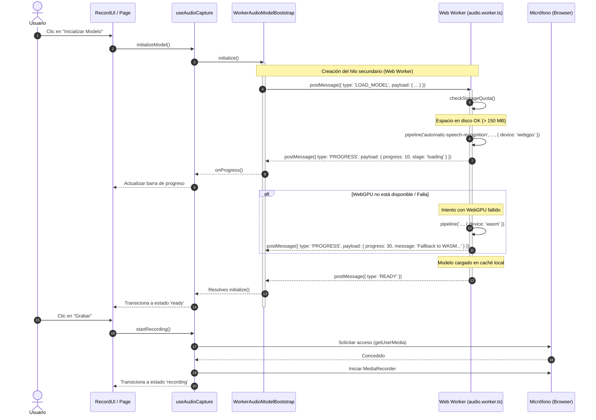

# Adaptadores Reales: Captura e Inferencia Local

:::info[Objetivo]
Definir la implementación real de los adaptadores de infraestructura para el slice de captura. Estos componentes interactúan con el hardware del dispositivo (micrófono) y con el Web Worker encargado de la inferencia local (Transformers.js) aplicando el patrón de Puertos y Adaptadores.
:::

## Arquitectura de Inferencia y Grabación

Para mantener una interfaz de usuario fluida y libre de bloqueos durante operaciones intensivas de CPU/GPU, la arquitectura separa la captura de audio y la inicialización de IA del hilo principal de renderizado (Main Thread).



---

## 🎙️ Grabación Nativa: `BrowserMediaRecorder`

El adaptador [BrowserMediaRecorder](file:///C:/Users/vgmil/.gemini/antigravity/worktrees/cicero/document-milestone-one-docusaurus/apps/web/src/core/adapters/audio/BrowserMediaRecorder.ts) implementa la interfaz [IAudioRecorder](file:///C:/Users/vgmil/.gemini/antigravity/worktrees/cicero/document-milestone-one-docusaurus/apps/web/src/core/ports/audio/IAudioRecorder.ts) para capturar voz mediante las APIs web nativas `mediaDevices` y `MediaRecorder`.

### Características Clave
1. **Selección Dinámica de MimeType**: Durante la instanciación, evalúa una lista de códecs soportados en orden de prioridad (Opus en WebM, Ogg, MP4, etc.) utilizando `MediaRecorder.isTypeSupported()`.
2. **Ciclo de Permisos Limpio**: Al solicitar permisos mediante `requestPermissions()`, inicializa un stream temporal de micrófono y lo apaga inmediatamente (`track.stop()`) para evitar que el indicador de grabación del sistema operativo permanezca encendido sin estar grabando.
3. **Manejo de Errores Tipados**: Traduce los fallos del navegador (permisos denegados, API no soportada en contextos no seguros HTTP) a instancias del error del dominio `CaptureError`.

```typescript
// Fragmento de control de parada segura y liberación del micrófono
this.mediaRecorder.onstop = () => {
  try {
    const type = this.mimeType || this.mediaRecorder?.mimeType || 'audio/webm';
    const audioBlob = new Blob(this.chunks, { type });
    this.cleanup();
    resolve(audioBlob);
  } catch (error) {
    this.cleanup();
    reject(new CaptureError('RECORDING_FAILED', 'Failed to compile recorded audio data', error));
  }
};
```

---

## 🧠 Inferencia Local y Web Workers

La descarga, almacenamiento y compilación del modelo de Hugging Face se ejecutan de manera aislada en un Web Worker. Esto evita congelar el renderizado (jank) en computadoras o dispositivos móviles de gama baja.

### 1. El Hilo de Fondo: `audio.worker.ts`
El archivo [audio.worker.ts](file:///C:/Users/vgmil/.gemini/antigravity/worktrees/cicero/document-milestone-one-docusaurus/apps/web/src/core/adapters/audio/audio.worker.ts) actúa como el núcleo del motor acústico:

*   **Verificación Preventiva de Espacio**: Llama a `navigator.storage.estimate()` antes de cualquier descarga para validar que queden al menos 150 MB disponibles en el navegador, previniendo descargas abortadas a la mitad por cuota excedida.
*   **Aceleración por WebGPU**: Configura Transformers.js para instanciar el pipeline usando `device: 'webgpu'` y el tipo de dato cuantizado `q8` (u 8 bits) para mitigar el consumo de memoria de video (VRAM).
*   **Fallback Transparente a WASM**: Si la GPU no soporta WebGPU o la compilación falla, captura el error de forma silenciosa e intenta la descarga de backend WebAssembly (WASM).
*   **Diseño Singleton**: Garantiza que el pipeline del modelo se inicialice una sola vez y persista en memoria global durante la ejecución de la PWA.

### 2. El Orquestador: `WorkerAudioModelBootstrap`
El adaptador [WorkerAudioModelBootstrap](file:///C:/Users/vgmil/.gemini/antigravity/worktrees/cicero/document-milestone-one-docusaurus/apps/web/src/core/adapters/audio/WorkerAudioModelBootstrap.ts) encapsula la comunicación por eventos con el Web Worker:

*   **Next.js Native Workers**: Instancia el worker de fondo utilizando la sintaxis nativa ESM compatible con Next.js y Webpack:
    ```typescript
    this.worker = new Worker(
      new URL('./audio.worker.ts', import.meta.url),
      { type: 'module' }
    );
    ```
*   **Gestión del Ciclo de Vida**: Expone métodos para liberar recursos como `terminate()`, el cual envía una señal `TERMINATE` para apagar el worker y limpiar las referencias globales de memoria.

---

## 🎛️ Orquestación y Resiliencia en la UI: `useAudioCapture`

El hook [useAudioCapture](file:///C:/Users/vgmil/.gemini/antigravity/worktrees/cicero/document-milestone-one-docusaurus/apps/web/src/hooks/useAudioCapture.ts) unifica ambos flujos y se encarga de la resiliencia ante pánicos del hilo secundario:

1.  **Detección de Pánicos (WASM Panic)**: A través del evento global `worker.onerror`, el hook detecta si el Web Worker sufre una caída fatal o desbordamiento de pila (stack overflow) no controlado por el adaptador, transicionando la UI a un estado `error` legible y seguro.
2.  **Botón de Reinicio Limpio (IA Reset)**: La función `reset()` destruye por completo el worker actual con `terminate()`, resetea los estados a `idle` y permite al usuario volver a intentar la inicialización del modelo sin necesidad de recargar toda la pestaña del navegador.

---

## 🧪 Estrategia de Testing en Jest (JSDOM)

Dado que JSDOM carece de soporte nativo para APIs avanzadas del navegador (`MediaRecorder`, `Worker`, `navigator.gpu`), se implementaron mocks globales robustos en [jest.setup.ts](file:///C:/Users/vgmil/.gemini/antigravity/worktrees/cicero/document-milestone-one-docusaurus/apps/web/jest.setup.ts):

*   **Mock de Web Worker**: Intercepta `postMessage` y `addEventListener` para permitir a las pruebas unitarias simular de forma síncrona los eventos de progreso (`PROGRESS`), listo (`READY`) o error (`ERROR`) enviados por el adaptador.
*   **Mock de MediaRecorder**: Implementa la máquina de estados del grabador (`recording`, `paused`, `inactive`) y emite Blobs ficticios con eventos de tipo `dataavailable` simulados cuando se ejecuta `stop()`.
*   **Mock de Storage & GPU**: Simulan respuestas deterministas de cuotas de almacenamiento y WebGPU no soportado para validar que la lógica de fallback a WASM y errores de disco funcionen de manera predecible en las suites.
