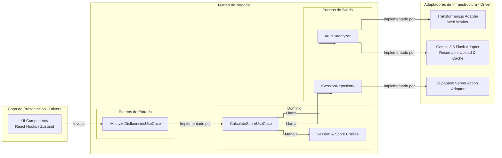

# Diagrama de Componentes (Hexagonal)

:::note Arquitectura objetivo
Esta pagina describe la estructura interna **objetivo** de la aplicacion. Algunas piezas todavia pueden estar en transicion dentro del repositorio actual, asi que debe leerse como direccion preferida y no como inventario cerrado de implementacion.
:::

Este diagrama presenta la estructura interna objetivo de la aplicacion Next.js aplicando **Arquitectura Limpia (Ports & Adapters)**, de modo que la IA y la base de datos funcionen como plugins del nucleo de negocio.

## Descripción de Componentes

### 1. Capa de Presentación (Drivers)
Incluye los componentes de Next.js, hooks personalizados (como `useGeminiSettings`), el modal neobrutalista `GeminiSettingsModal` y el store de Zustand. Su responsabilidad es inicializar la grabación, gestionar la API Key del usuario de manera segura en local, e instanciar el adaptador de audio correspondiente.

### 2. Núcleo (Dominio y Casos de Uso)
- **Dominio**: Contiene la lógica de negocio pura (`CalculateScoreUseCase` y entidades). Recibe los datos de la transcripción y ejecuta el algoritmo de puntuación basándose en el conteo de muletillas.
- **Puertos de Salida**: `IAudioAnalyzer` define el contrato del motor de inferencia (recibe `Float32Array` y devuelve texto e interpolación lineal de timestamps).

### 3. Adaptadores de Infraestructura (Driven)
- **Gemini 3.5 Flash Adapter**: Implementación que segmenta el audio en fragmentos de 3 minutos, codifica a WAV localmente, gestiona la subida resumible y concurrente mediante Google Files API y realiza la inferencia mediante el modelo `gemini-3.5-flash` con posterior limpieza de los archivos subidos. Soporta caché offline en IndexedDB.
- **Transformers.js Adapter**: Adaptador local alternativo para inferencia en el cliente mediante ONNX y WebGPU/WASM.
- **Supabase Adapter**: Adaptador para persistir métricas de sesión de oratoria en la base de datos externa a través de Server Actions.

