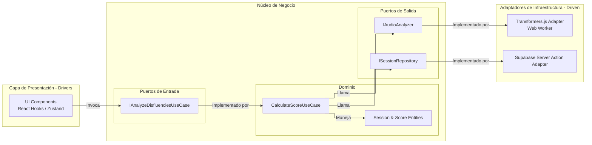

# Diagrama de Componentes (Hexagonal)

:::note Arquitectura objetivo
Esta pagina describe la estructura interna **objetivo** de la aplicacion. Algunas piezas todavia pueden estar en transicion dentro del repositorio actual, asi que debe leerse como direccion preferida y no como inventario cerrado de implementacion.
:::

Este diagrama presenta la estructura interna objetivo de la aplicacion Next.js aplicando **Arquitectura Limpia (Ports & Adapters)**, de modo que la IA y la base de datos funcionen como plugins del nucleo de negocio.

## Descripción de Componentes

### 1. Capa de Presentación (Drivers)
Incluye los componentes de Next.js, hooks personalizados y el store de Zustand. Su responsabilidad objetivo es iniciar la grabacion y, posteriormente, renderizar la transcripcion completa, iterando sobre los timestamps para marcar en rojo las muletillas detectadas por el Caso de Uso.

### 2. Núcleo (Dominio y Casos de Uso)
- **Dominio**: Contiene la logica pura. En la arquitectura objetivo recibe la transcripcion completa (texto y timestamps de palabras) y concentra el algoritmo que decide que palabras se consideran disfluencias para calcular el score final.
- **Puertos de Salida**: `IAudioAnalyzer` define el contrato que requiere el dominio: *"Dame una funcion que reciba un blob de audio y me devuelva una transcripcion completa con timestamps por palabra"*.

### 3. Adaptadores de Infraestructura (Driven)
- **Transformers.js Adapter**: Implementacion tecnica prevista para encapsular la complejidad de instanciar un Web Worker, cargar el modelo `CrisperWhisper-ONNX` del Hugging Face Hub (o cache local), procesar el audio y formatear la salida para cumplir con la interfaz `IAudioAnalyzer`.
- **Supabase Adapter**: Adaptador previsto para ejecutarse dentro de una Server Action por seguridad y realizar el `INSERT` de los resultados finales en PostgreSQL.
