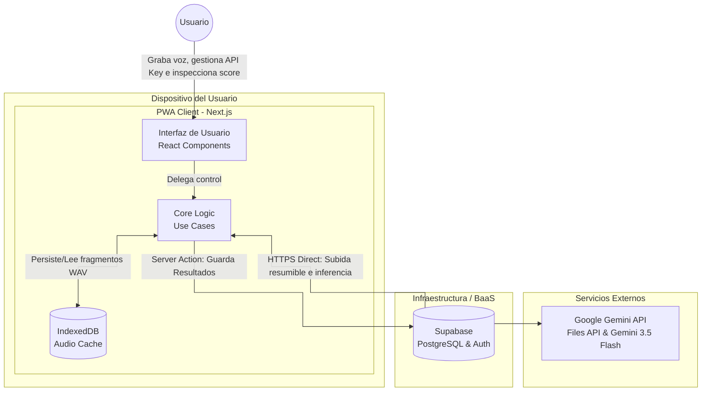

# Diagrama de Contenedores (C4)

:::note Arquitectura objetivo
Este diagrama describe los contenedores **objetivo** del sistema. Debe interpretarse como la topologia tecnica preferida para el MVP, aunque algunas piezas sigan en transicion dentro del repositorio.
:::

Este diagrama representa los contenedores de software previstos para **Cicero**. La direccion tecnica prioriza un enfoque "Client-Side AI" utilizando Transformers.js en un Web Worker.

## Descripción de Contenedores

1.  **PWA Client (Next.js)**: Actúa como interfaz gráfica, gestor de estado local (`Zustand`), codificador de audio, orquestador de colas concurrentes y consumidor directo de servicios externos.
    *   **UI**: Componentes React responsables de la captura visual, el modal de configuración de la API Key (`GeminiSettingsModal`), y el resaltado visual de muletillas.
    *   **Core Logic**: Casos de uso de TypeScript puros. Coordina la segmentación del audio, la subida paralela resumible, la interpolación lineal de timestamps, la detección de muletillas y el cálculo de la puntuación.
    *   **IndexedDB**: Base de datos local en el navegador utilizada para persistir temporalmente los fragmentos WAV de 3 minutos. Esto garantiza tolerancia a caídas de red y reintentos automáticos (incluso tras un refresco de página).
2.  **Google Gemini API**: Endpoint directo al que el cliente PWA envía sus credenciales BYOK y sube los archivos de audio en fragmentos, recibiendo las transcripciones estructuradas y limpiando los recursos inmediatamente con peticiones `DELETE`.
3.  **Supabase**: Base de datos como servicio. Solo recibe el payload final (texto completo, score, muletillas detectadas, fecha y metadatos) una vez concluido el análisis, manteniendo nulo el costo de almacenamiento y transferencia de audio para el servidor de Cicero.

