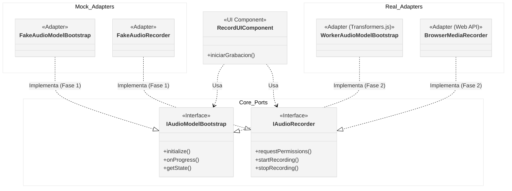

# Contratos: Inicialización y Captura

:::info Objetivo
Definir los contratos base del slice de captura para estandarizar el lenguaje técnico entre Front, Back y DevSecOps. Estos contratos están implementados como Puertos en la capa Core de la aplicación web.
:::

## Ubicación de los Contratos
Los contratos de código se encuentran en:
`apps/web/src/core/ports/audio/`

## Estados del Flujo de Captura

El sistema de captura y modelo de audio transita por los siguientes estados (`AudioCaptureState`):

- `idle`: Estado inicial. La aplicación está lista pero no se ha solicitado la carga del modelo.
- `loading-model`: El modelo de IA (Transformers.js/ONNX) se está descargando o inicializando en memoria/Worker.
- `ready`: El modelo está cargado, los permisos de micrófono fueron concedidos y el sistema está listo para grabar.
- `recording`: Captura de audio en curso.
- `error`: Ocurrió un fallo en algún punto del flujo (ej. permisos denegados, fallo de red al descargar modelo).

## Objetos de Transferencia de Datos (DTOs)

### Progreso y Carga (`ProgressDTO`)
```typescript
export interface ProgressDTO {
  progress: number; // Porcentaje de 0 a 100
  stage: string; // Ej. 'downloading', 'extracting', 'loading'
  estimatedTimeRemaining?: number; // En milisegundos
}
```

### Permisos (`PermissionsDTO`)
```typescript
export interface PermissionsDTO {
  microphoneGranted: boolean;
}
```

### Manejo de Errores (`ErrorDTO`)
```typescript
export interface ErrorDTO {
  code: 'PERMISSION_DENIED' | 'MODEL_LOAD_FAILED' | 'RECORDING_FAILED' | 'UNKNOWN';
  message: string;
  details?: unknown;
}
```

## Puertos (Interfaces)

### IAudioModelBootstrap

Responsable de la preparación e inicialización del entorno de inferencia (el Web Worker y los modelos).

```typescript
export interface IAudioModelBootstrap {
  /** Inicia la descarga/preparación del modelo */
  initialize(): Promise<void>;

  /** Suscripción a eventos de progreso para la UI */
  onProgress(callback: (progress: ProgressDTO) => void): void;

  /** Obtiene el estado actual de la inicialización */
  getState(): AudioCaptureState;
}
```

### IAudioRecorder

Responsable de interactuar con el hardware del dispositivo para la captura de voz.

```typescript
export interface IAudioRecorder {
  /** Solicita los permisos necesarios al usuario (Micrófono) */
  requestPermissions(): Promise<PermissionsDTO>;

  /** Inicia la grabación del stream de audio */
  startRecording(): Promise<void>;

  /** Detiene la grabación y devuelve el archivo/buffer capturado */
  stopRecording(): Promise<Blob>;

  /** Aborta la grabación actual sin guardar resultados */
  cancelRecording(): void;
}
```

## Estrategia de Implementación: Mock-First

Para evitar bloqueos entre equipos, la arquitectura promueve el uso de implementaciones **Mock** iniciales mediante el patrón de Puertos y Adaptadores.

### Diagrama de Componentes (Inyección de Dependencias)



- **Fase 1 (UI Development)**: Utilizará `FakeAudioModelBootstrap` y `FakeAudioRecorder` (pendientes de implementar) para validar estados de carga y transiciones de pantalla sin necesidad de hardware o modelos reales.
- **Fase 2 (Integración Real)**: Posteriormente se implementarán los adaptadores para `Transformers.js` (Worker) y la API nativa de `MediaRecorder` cumpliendo estas mismas interfaces, inyectándose en la UI sin requerir cambios en la vista.
