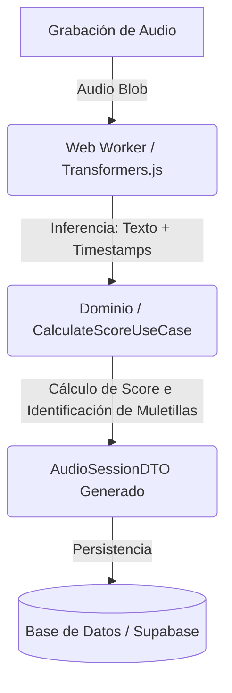

# Persistencia de Sesión de Audio

:::info[Objetivo]
Alinear el shape mínimo y los contratos para la persistencia futura de las sesiones de audio grabadas y analizadas. Este diseño garantiza compatibilidad y evita refactorizaciones cuando se conecte con el backend (ej. Supabase) en fases posteriores.
:::

## Flujo de Orquestación y Persistencia

Como se describe en el [Diagrama de Secuencia](./secuencia.md), la evaluación y transcripción del audio ocurre enteramente en el lado del cliente (Client-Side AI) mediante un Web Worker. Una vez completado este proceso, el frontend genera un payload consolidado con las métricas y la transcripción detallada, enviándolo para su almacenamiento definitivo.

---

## Estructura del Payload Mínimo (`AudioSessionDTO`)

A continuación se detallan los campos que componen la sesión de audio que se persistirá. Estos tipos TypeScript están definidos como contratos en el core del monorepo (`apps/web/src/core/ports/audio/types.ts`).

| Campo | Tipo | Requerido | Descripción |
| :--- | :--- | :---: | :--- |
| `id` | `string` | **Sí** | Identificador único de la sesión (se recomienda UUID v4). |
| `title` | `string` | No | Título o descripción asignada por el usuario (ej. "Presentación de Ventas"). |
| `createdAt` | `string` | **Sí** | Fecha y hora de creación de la sesión en formato ISO 8601. |
| `durationSeconds` | `number` | **Sí** | Duración total de la grabación de audio en segundos. |
| `audioUrl` | `string` | No | URL pública o firmada del archivo físico de audio en el storage (opcional si no se desea persistir el audio). |
| `status` | `'completed' \| 'processing' \| 'failed'` | **Sí** | Estado del registro de la sesión. Útil para coordinar procesamiento asíncrono futuro. |
| `transcription` | `object` | **Sí** | Contenedor de la transcripción literal del modelo. |
| `transcription.text` | `string` | **Sí** | Texto completo y corrido de la transcripción. |
| `transcription.chunks` | `AudioChunkDTO[]` | **Sí** | Lista ordenada de palabras con metadatos de sincronización temporal. |
| `metrics` | `SessionMetricsDTO` | **Sí** | Métricas calculadas para la evaluación de fluidez. |

### Detalle de Chunks de Transcripción (`AudioChunkDTO`)

Cada elemento dentro de `transcription.chunks` representa una palabra identificada por el modelo de IA:

| Campo | Tipo | Requerido | Descripción |
| :--- | :--- | :---: | :--- |
| `word` | `string` | **Sí** | Palabra o token transcrito por el modelo. |
| `start` | `number` | **Sí** | Segundo exacto de inicio de la pronunciación de la palabra. |
| `end` | `number` | **Sí** | Segundo exacto de fin de la pronunciación de la palabra. |
| `isFillerWord` | `boolean` | **Sí** | `true` si el motor identificó esta palabra como una muletilla (ej. "eh", "bueno"). |

### Detalle de Métricas de Fluidez (`SessionMetricsDTO`)

Las métricas agregadas que evalúan la calidad del discurso:

| Campo | Tipo | Requerido | Descripción |
| :--- | :--- | :---: | :--- |
| `overallScore` | `number` | **Sí** | Puntaje global de la sesión (rango 0 a 100), donde 100 indica fluidez perfecta. |
| `fillerWordsCount` | `number` | **Sí** | Conteo total de muletillas detectadas en el discurso. |
| `wordsPerMinute` | `number` | **Sí** | Velocidad o ritmo del habla (Palabras Por Minuto - WPM). |
| `fillerWordsBreakdown` | `Record<string, number>` | **Sí** | Diccionario que mapea cada muletilla detectada con su cantidad de apariciones. |

---

## Restricciones y Reglas de Persistencia

1. **Inmutabilidad de los Resultados**: Una vez que una sesión es guardada con el estado `completed`, su transcripción, chunks y métricas no deben ser alterados. Cualquier reevaluación generará una nueva sesión con un identificador único diferente.
2. **Independencia del Audio Físico**: El almacenamiento en base de datos de los metadatos y análisis de la sesión (`AudioSessionDTO`) debe ser viable de forma autónoma. El archivo de audio físico (`audioUrl`) es opcional y puede ser depurado o no subirse por motivos de optimización o privacidad del usuario.
3. **Optimización de Lectura (Frontend)**: Al incluir `isFillerWord: boolean` directamente en los chunks persistidos, el frontend puede renderizar de forma instantánea el texto con el resaltado de muletillas sin necesidad de cargar diccionarios o ejecutar el algoritmo de detección en cada visualización.
4. **Preparación sin Backend Real**: En el estado actual del repositorio (Fase 1/Spike), este payload es simulado en los adaptadores mock mediante memoria volátil o `localStorage`. La definición formal de estas interfaces permite implementar adaptadores reales para Supabase de forma transparente sin modificar los componentes visuales ni la lógica del dominio.
