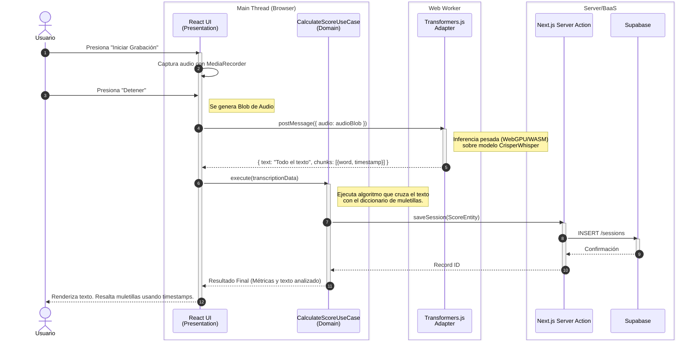

# Diagramas de Secuencia

:::note Arquitectura objetivo
Este flujo muestra la orquestacion **esperada** para el MVP. Sirve como referencia de comportamiento deseado y puede adelantarse al estado actual del repositorio.
:::

El siguiente diagrama detalla la orquestacion asincrona objetivo entre el hilo principal (UI), el hilo secundario (Web Worker) y la base de datos externa.

## 🎙️ Caso de Uso: Transcripción Verbatim y Generación de Score

Este escenario muestra como se espera que el audio capturado se procese usando Transformers.js sin bloquear la experiencia del usuario.

### Explicación del Flujo
1.  **Carga Aislada**: El modelo de IA residiria en el hilo secundario (`Web Worker`). Esto evita que el navegador se congele mientras procesa redes neuronales.
2.  **Inferencia Literal**: El worker utilizaria `CrisperWhisper` via Transformers.js. No filtraria el audio; transcribiria todo, devolviendo un JSON con la cadena de texto completa y los metadatos precisos (tiempos de inicio/fin) de cada palabra pronunciada.
3.  **Analisis (Casos de Uso)**: La UI pasaria esta metadata al Caso de Uso puro. Este modulo actuaria como el "cerebro evaluador": detectaria cuales palabras del JSON son muletillas y formularia el score general de la presentacion.
4.  **Persistencia (Server Action)**: El resultado se enviaria de forma segura a traves de una Server Action a Supabase, aprovechando la infraestructura de Next.js.
