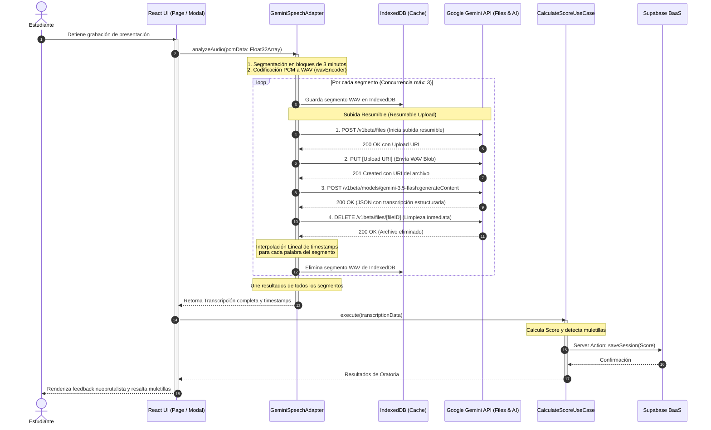
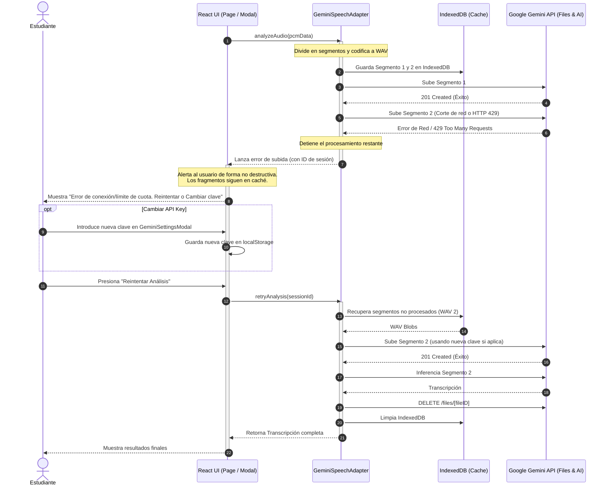
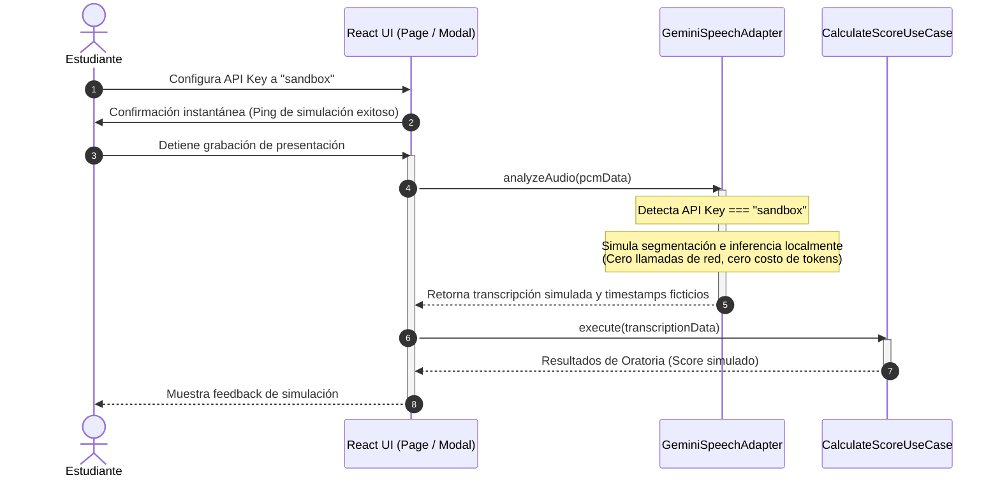

# Diagramas de Secuencia

:::note Arquitectura de Transición a Gemini
Estos diagramas detallan la orquestación asíncrona y la resiliencia en el cliente al utilizar la API de **Google Gemini 3.5 Flash** (esquema BYOK). Se contemplan el flujo exitoso con segmentación, el flujo de error y recuperación con IndexedDB, y el flujo de simulación fuera de línea (Sandbox).

---

## 1. Flujo Normal: Segmentación, Subida Resumible e Inferencia

Este diagrama detalla cómo se procesa un audio de presentación dividiéndolo en fragmentos de 3 minutos, subiéndolos en paralelo con control de concurrencia y transcribiéndolos mediante la API de Google sin costos de servidor.

---

## 2. Flujo de Error y Reintento: Resiliencia con IndexedDB y Mitigación 429

Si ocurre un corte de internet o se excede el límite de solicitudes (HTTP 429), los fragmentos WAV permanecen a salvo en la base de datos local `IndexedDB`. El estudiante puede reintentar el proceso sin perder la grabación, incluso cambiando su API Key.

---

## 3. Flujo Sandbox: Simulación Local Offline

Cuando la clave configurada es exactamente `"sandbox"`, el adaptador entra en modo simulación local. No realiza llamadas de red ni consume tokens, ideal para pruebas de desarrollo rápidas y demostraciones offline.

