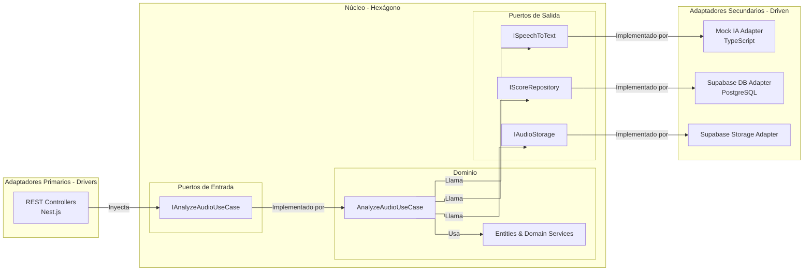

# Diagrama de Componentes (Hexagonal)

Este diagrama detalla la estructura interna del **Core Backend (Nest.js)** siguiendo los principios de la **Arquitectura Hexagonal (Ports & Adapters)**. Aquí se visualiza la separación entre los disparadores (Drivers), la lógica de negocio (Core) y las dependencias externas (Driven).

## Descripción de Componentes

### 1. Adaptadores Primarios (Drivers)
Son los puntos de entrada a la aplicación. En nuestro caso, los **REST Controllers** de Nest.js se encargan de recibir las peticiones HTTP, validar los DTOs básicos y delegar la ejecución a los puertos de entrada.

### 2. Núcleo (Core / Hexágono)
Es donde reside el valor real del negocio.
- **Puertos de Entrada (Input Ports)**: Interfaces que definen los casos de uso disponibles para los Drivers.
- **Dominio**: Contiene la lógica pura (Domain Services) y las entidades. El `AnalyzeAudioUseCase` orquestará la grabación, el análisis y la persistencia.
- **Puertos de Salida (Output Ports)**: Interfaces que definen los contratos que el dominio necesita de los servicios externos.

### 3. Adaptadores Secundarios (Driven)
Son las implementaciones técnicas de los puertos de salida:
- **Mock IA Adapter**: Simula el procesamiento de lenguaje natural y conteo de muletillas.
- **Supabase DB Adapter**: Implementación concreta de la persistencia de scores en PostgreSQL.
- **Supabase Storage Adapter**: Maneja la subida y referencia de archivos de audio si fuera necesario en el futuro (actualmente local temporal).

## Inversión de Dependencia
Observa que las flechas siempre apuntan hacia el **Core** o son llamadas desde él a través de **Interfaces (Ports)**. Esto asegura que el dominio no dependa de si usamos Supabase, Nest.js o cualquier otra tecnología externa, cumpliendo con los estándares de **Clean Architecture**.
