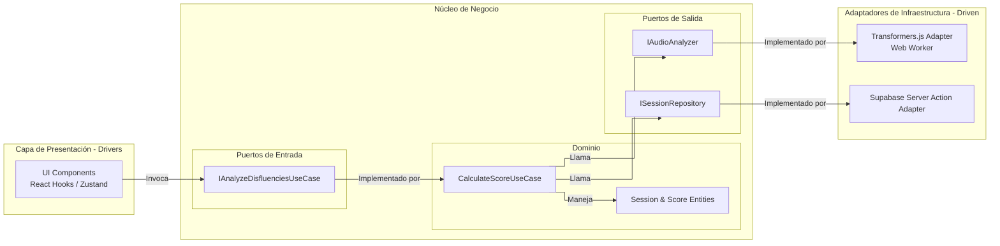

# Diagrama de Componentes (Hexagonal)

Este diagrama detalla la estructura interna de nuestra aplicación Next.js aplicando **Arquitectura Limpia (Ports & Adapters)**, asegurando que la IA y la Base de Datos sean meros plugins de nuestro núcleo de negocio.

## Descripción de Componentes

### 1. Capa de Presentación (Drivers)
Son los componentes de Next.js, Hooks personalizados y el store de Zustand. Se encargan de iniciar la grabación y, posteriormente, renderizar la transcripción completa, iterando sobre los timestamps para marcar en rojo las muletillas detectadas por el Caso de Uso.

### 2. Núcleo (Dominio y Casos de Uso)
- **Dominio**: Contiene la lógica pura. Recibe la transcripción completa (texto y timestamps de palabras) y contiene el algoritmo que decide qué palabras se consideran disfluencias para calcular el score final.
- **Puertos de Salida**: `IAudioAnalyzer` define el contrato que requiere el dominio: *"Dame una función que reciba un blob de audio y me devuelva una transcripción completa con timestamps por palabra"*.

### 3. Adaptadores de Infraestructura (Driven)
- **Transformers.js Adapter**: Implementación técnica vital. Encapsula la complejidad de instanciar un Web Worker, cargar el modelo `CrisperWhisper-ONNX` del Hugging Face Hub (o caché local), procesar el audio y formatear la salida para cumplir con la interfaz `IAudioAnalyzer`.
- **Supabase Adapter**: Ejecutado dentro de una Server Action por seguridad, realiza el `INSERT` de los resultados finales en PostgreSQL.
