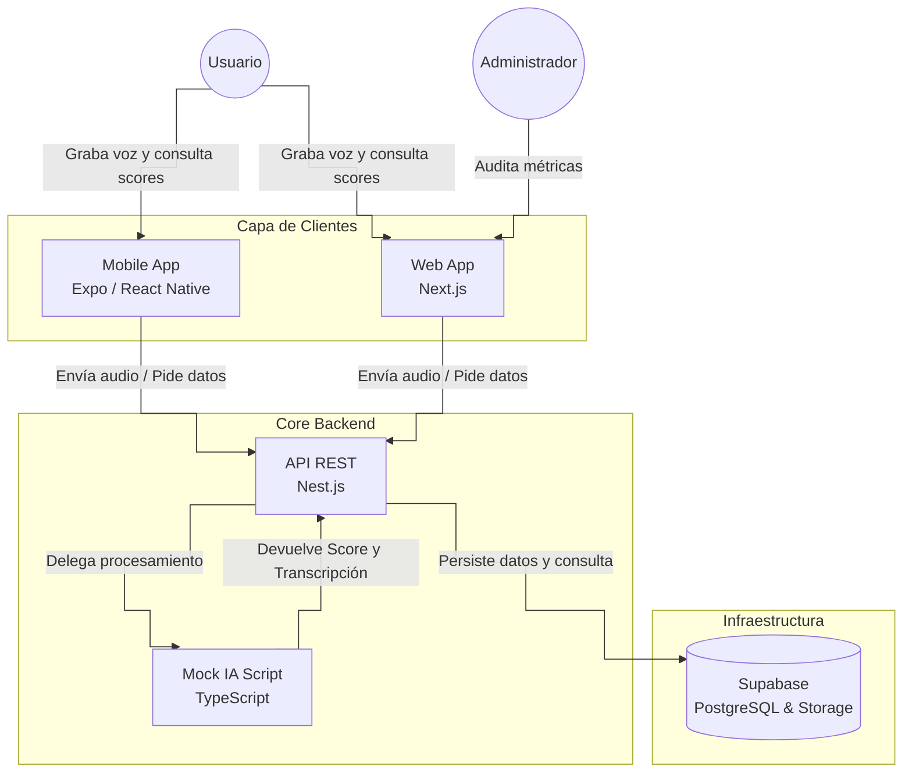

# Diagrama de Contenedores (C4)

Este diagrama representa los contenedores de software que componen el sistema **Cicero**. Se ha optado por centralizar la lógica de negocio en una API dedicada, manteniendo los clientes lo más ligeros posible y asegurando una comunicación estructurada.

## Descripción de Contenedores

1.  **Capa de Clientes (Mobile & Web)**: Clientes ligeros responsables únicamente de la captura de audio (UI/UX) y visualización de resultados. Consumen la API centralizada para todas las operaciones de negocio.
2.  **API REST (Nest.js)**: Orquestador principal del sistema. Recibe el audio de los clientes, invoca el módulo de análisis, calcula los scores y maneja la persistencia de manera segura.
3.  **Mock IA Script (TypeScript)**: Módulo interno de la API que simula el procesamiento de voz a texto y la detección de muletillas.
4.  **Supabase**: Proveedor de infraestructura (BD relacional y Storage) accedido exclusivamente a través del backend para garantizar la integridad y seguridad de los datos.
