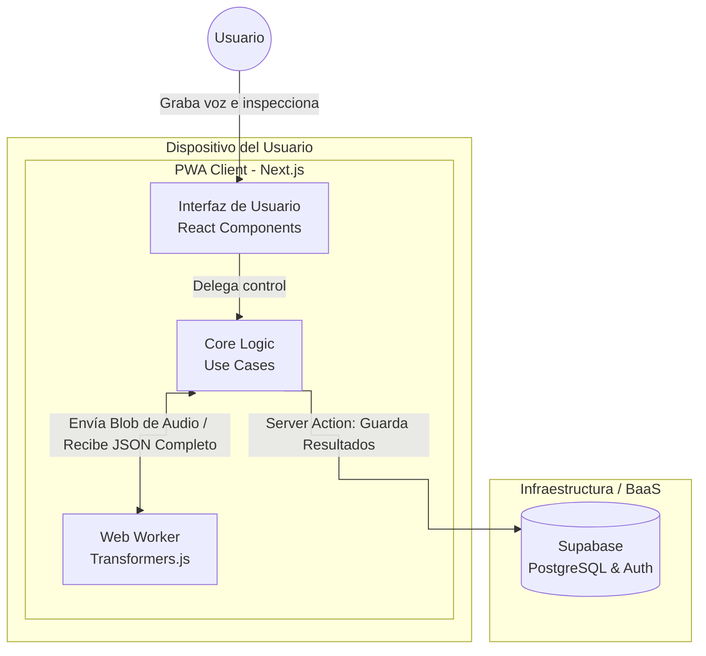

# Diagrama de Contenedores (C4)

Este diagrama representa los contenedores de software que componen el sistema **Cicero**. Adoptamos un enfoque "Client-Side AI" utilizando Transformers.js en un Web Worker.

## Descripción de Contenedores

1.  **PWA Client (Next.js)**: Actúa como interfaz gráfica y motor de procesamiento pesado.
    *   **UI**: Componentes React responsables de la captura visual. Lee el texto completo y resalta las palabras usando los timestamps de la IA.
    *   **Core Logic**: Casos de uso de TypeScript puros. Recibe el texto transcrito de la IA, busca en él la lista de muletillas y calcula el puntaje final.
    *   **Web Worker (Transformers.js)**: Un hilo secundario del navegador. Descarga (una vez) y ejecuta el modelo `CrisperWhisper-ONNX`. Alimenta el audio capturado a la red neuronal (vía WebGPU/WASM) sin bloquear la interfaz gráfica del usuario.
2.  **Supabase**: Base de datos como servicio. Solo recibe el payload final (texto completo, puntaje, duración) tras el análisis local.
