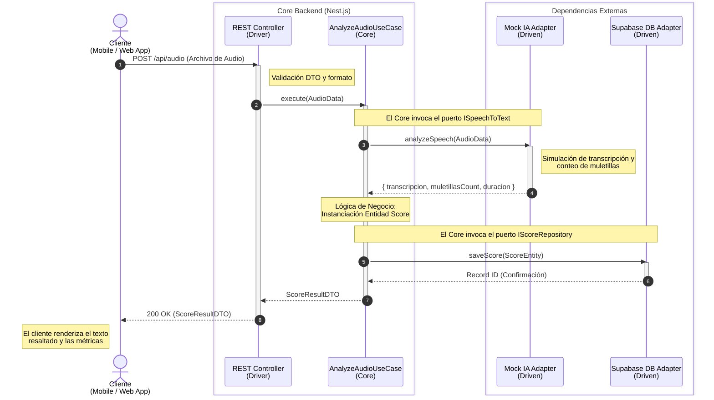

# Diagramas de Secuencia

Los diagramas de secuencia ilustran cómo los componentes interactúan en el tiempo para satisfacer un **Caso de Uso** específico. Esto nos ayuda a entender el ciclo de vida de una petición desde el cliente hasta la base de datos, pasando por nuestra arquitectura hexagonal en **Nest.js**.

## 🎙️ Caso de Uso: Procesamiento de Audio y Generación de Score

Este diagrama representa el escenario principal (Happy Path) detallado en la sección de [Casos de Uso (Gherkin)](./casos-de-uso): el cliente envía una grabación de voz y espera recibir un análisis de su oratoria.

### Explicación del Flujo
1.  **Petición Inicial**: El usuario finaliza la grabación y el cliente (`Mobile` o `Web`) envía el audio a la ruta expuesta por el controlador REST (Adaptador Primario).
2.  **Delegación al Dominio**: El controlador no procesa reglas de negocio, solo valida el formato (DTO) y pasa los datos al Caso de Uso (`AnalyzeAudioUseCase`).
3.  **Procesamiento (Mock IA)**: El caso de uso necesita analizar el texto, por lo que invoca la interfaz `ISpeechToText`. El adaptador de Mock IA recibe esta llamada, procesa el audio simulando una IA real y devuelve los conteos.
4.  **Lógica Central**: Con los datos de la IA, el Caso de Uso calcula el porcentaje de limpieza (ej. `(palabras totales - muletillas) / palabras totales * 100`) y crea una Entidad de Dominio `Score`.
5.  **Persistencia**: El caso de uso llama a la interfaz `IScoreRepository` para guardar la entidad. El adaptador de Supabase ejecuta la inserción real en la base de datos PostgreSQL.
6.  **Respuesta**: La confirmación viaja de regreso por las capas hasta que el controlador devuelve un DTO de respuesta (`ScoreResultDTO`) al cliente para su visualización.
