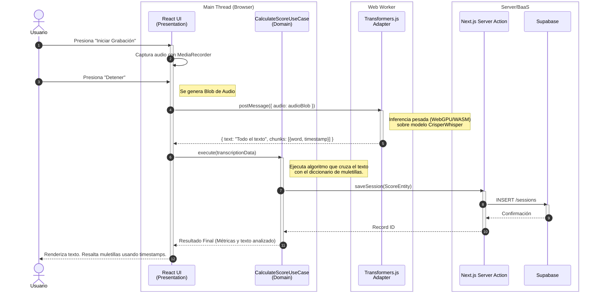

# Diagramas de Secuencia

El siguiente diagrama detalla la orquestación asíncrona entre el hilo principal (UI), el hilo secundario (Web Worker) y la base de datos externa.

## 🎙️ Caso de Uso: Transcripción Verbatim y Generación de Score

Este escenario muestra cómo el audio capturado se procesa usando Transformers.js sin bloquear la experiencia del usuario.

### Explicación del Flujo
1.  **Carga Aislada**: El modelo de IA reside en el hilo secundario (`Web Worker`). Esto evita que el navegador se congele mientras procesa redes neuronales.
2.  **Inferencia Literal**: El worker utiliza `CrisperWhisper` vía Transformers.js. No filtra el audio; transcribe todo, devolviendo un JSON con la cadena de texto completa y los metadatos precisos (tiempos de inicio/fin) de cada palabra pronunciada.
3.  **Análisis (Casos de Uso)**: La UI pasa esta rica metadata al Caso de Uso puro. Este módulo es el "cerebro evaluador": detecta cuáles palabras del JSON son muletillas y formula el Score general de la presentación.
4.  **Persistencia (Server Action)**: El resultado (ahora un simple objeto JSON con puntajes y texto) se envía de forma segura a través de una Server Action a Supabase, aprovechando la infraestructura de Next.js.
